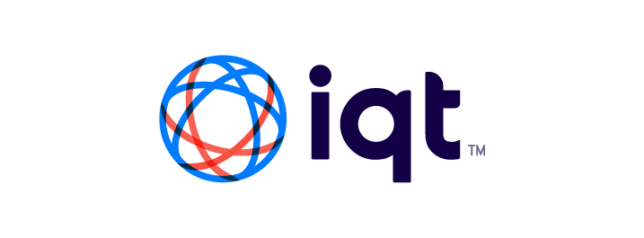
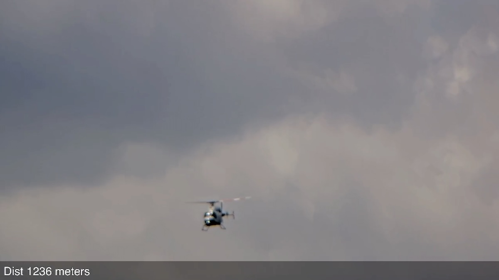

<div align="center">
  <a href="https://iqt.org">
    
  </a>

<h1 align="center">SkyScan</h1>
</div>

*This is an update version of the [SkyScan](https://github.com/IQTLabs/SkyScan) system that is built using IQT's [EdgeTech components](https://github.com/IQTLabs/edgetech-core).*

<div>
<a href="https://youtu.be/tm_L4FvWtto?si=xqbN541eXFFGLOf1"></a>
<p>Sample of video captured by SkyScan</p>
</div>

<div >
SkyScan use the ADS-B location broadcasts from aircraft to track them with a camera. A standard Pan Tilt Zoom (PTZ) security can be used, a specialized camera is not required. A control loop is used to smoothly track the aircraft as it flies by.
<p>
SkyScan has been built around the APIs for Axis security cameras, but it could be extended to work with any camera with an API. 
</p>
</div>

<br/>
<br/>
<h2>Requirements</h2>
- Recent version of Docker and Docker Compose
- RTL-SDR dongle with an Antenna that works at 1090MHz
- Linux computer, a Raspberry Pi 4 or 5 will work
- Axis PTZ Camera (tested with an AXIS P5655-E PTZ )


# Getting Started

## Pre-Requisites  

Make sure you have Docker installed, instructions are on the Docker site: 

Raspberry Pi OS (64 bit) https://docs.docker.com/engine/install/debian/
Raspberry Pi OS (32 bit) https://docs.docker.com/engine/install/raspberry-pi-os/
Ubuntu https://docs.docker.com/engine/install/ubuntu/

You should also have the RTL SDR tools installed. You check to make sure the SDR is working as intended with the `rtl_test` command. The tools can be installed with `sudo apt install rtl-sdr`.

## Install

Clone a local copy of this repo onto the server it will be deployed on:

```bash
git clone https://github.com/IQTLabs/edgetech-skyscan.git
```

The PTZ camera should be reachable over the network from the Linux computer you are running SkyScan on. Make sure the camera is as level as possible and pointed towards True North.

## Configuration

Start by copying `skyscan.env` to `.env`

```bash
cp skyscan.env .env
```

Each of the modules in SkyScan can be configured via Environment variables. The Docker Compose file sets these values from files. There are comments alongside each of the values to provide a description of what is required. Here is a walk through of the core values that need to be configured:

### Core Modules
#### .env
- The **DEPLOYMENT** is used to help describe where SkyScan is being deployed. There should be no spaces, use an `-` or `_` instead. This value is used to construct the MQTT Topics.
- In order to determine **TRIPOD_LATITUDE** and **TRIPOD_LONGITUDE** use Google Maps, and right click on the tripod's location to copy the lat/long.  
- The **TRIPOD_ALTITUDE** needs to be provided based on the WGS84 Ellipsoid, which is different than the barometric pressure based altitude you get from your phone. Start by getting your altitude based on barometric pressure using an App on your phone (make sure you convert from Feet to Meters). Then use this conversion web app to get that elevation in the WGS84 Ellipsoid: [https://www.unavco.org/software/geodetic-utilities/geoid-height-calculator/geoid-height-calculator.html](https://www.unavco.org/software/geodetic-utilities/geoid-height-calculator/geoid-height-calculator.html)
- Initially leave **YAW**, **PITCH**, and **ROLL** at 0.0. Once the deployment is up and running you can adjust these values to compensate for the camera being un-level or not correctly pointing to True North.
- The **ZOOM** value ranges from 0 which is the widest setting, to 9999, which is zoomed in all the way. Start with a low number initially until the deployment has been dialed in.
- The Axis camera you will be using needs to be reachable from the server you are deploying SkyScan on. Complete **CAMERA_IP**, **CAMERA_USER**, and **CAMERA_PASSWORD** with the values for your camera. If you need help finding the IP address for the camera, the Linux `avahi-discover` command can help find Axis cameras on you network using Bonjour.
- You should generally not need to change any of the MQTT Topic names.

#### axis-ptz-controller.env
- Configure **PAN_RATE_MAX** & **TILT_RATE_MAX** based on the values for the camera being used. The value is in degrees / second and should be listed in the dataset.
- After everything is up and running, try adjusting the **PAN_GAIN** & **TILT_GAIN** values. If the camera is swaying rapidly back and forth as it tracks a plane, the gain value is probably too high. If the camera has having trouble keeping up with the plane, it is probably too low.

#### piaware.env
- Set **TZ** to the appropriate timezone for where the camera is located
- Adjust the **DUMP1090_DEVICE** value if you wish to use an RTL-SDR that is not the first one

#### skyscan-c2.env
- Use **OBJECT_DISTANCE_THRESHOLD**, **MIN_ALTITUDE**, **MAX_ALTITUDE**, & **MIN_TILT** values to limit which aircraft can be selected for the camera to track. This
is helpful when you want to do things like not track higher flying aircraft because of clouds or only select aircraft that are high enough over the horizon to be seen of obstacles.

## Running

After you have finished configuring the environment files, start everything up using Docker Compose:

```bash
docker compose pull
docker compose up
```

After everything is up and running, goto the web interface for the camera to view what is being tracked.

### PiAware UI

The PiAware Web UI lets you view the aircraft it is currently tracking. It is available on port 8080 of the computer SkyScan is running on. For example: http://localhost:8080


## Tuning

Once you have SkyScan up an running, the next step is to dial it in.

### Leveling the camera

It is important to have the camera as level as possible in order for it to track accurately. This can be done either by physically leveling the camera or adjusting configuration parameters for yaw, pitch, and roll corrections. The [Manfrotto 410 Tripod Head](https://www.manfrotto.com/us-en/410-junior-geared-tripod-head-easy-to-use-ergonomic-knobs-410/) makes physical leveling easy because each of the axis has a geared adjustment knob. 

Orientation corrections can also be applied via configuration. It is best to explore the correct setting dynamically by trying different values via MQTT. The [Config](notebooks/config.ipynb) has an example jupyter notebook that shows how to do that. Once you find acceptable values, enter them into your **.env** value so that they are used each time it is run.

### Manual Control

Pointing the camera at static landmarks can help level the camera. To do that, start SkyScan using the following command:

```bash
docker compose -f docker-compose-manual.yaml
```

Then refer to the section of the [Config](notebooks/config.ipynb) Jupyter notebook on manual control.

### Tracking Loop

A control loop is used to track the aircraft. It takes into account where the camera currently is, where the aircraft is and how fast it is moving and then figures out how fast the camera needs to be moving in the Pan and Tilt axises. You can adjust how the control loop reacts to deltas between the camera and aircraft by adjust the *PAN_GAIN* and *TILT_GAIN* in [axis-ptz-controller.env](axis-ptz-controller.env). If the camera is oscillating around the plane, it is a sign that the gain needs to be reduced. If the camera is unable to keep up with the plane, then the gain can be increased. The gain values can be less than 1.0. You can experiment with different values using the [Config](notebooks/config.ipynb) Jupyter notebook.

### Avoiding Obstacles

It is likely that there will a number of obstacles around the camera that are blocking your view. If they are pretty uniform around the camera, you can specify a *MIN_TILT* value in [skyscan-c2.env](skyscan-c2.env) and it will ignore all aircraft below that tilt value. However, if the obstacles are less uniform you can use the [Occlusion Mapper](https://github.com/IQTLabs/edgetech-occlusion-mapper) to ignore only portions of the cameras view area.

You can start up the Occlusion Mapper container with the following command:

```bash
docker compose -f docker-compose-occlusion.yaml
```

Following the instructions in the [Occlusion Mapper](https://github.com/IQTLabs/edgetech-occlusion-mapper) repo for mapping out the obstacles. After you have finished mapping the occlusions, restart SkyScan using the normal docker-compose.yaml file.


# Components

### SkyScan Modules

IQT's EdgeTech framework is a modular approach for building systems. Each component of a system is a stand alone Docker container, which communicate between each other using MQTT messages. 

The following EdgeTech modules are used in SkyScan:

- **MQTT Dev**: A Mosquito based MQTT Broker. It allows MQTT messages to be exchanged between the different SkyScan Modules. It has a very simple configuration to make initial deployments as easy as possible, but as a result there are no security features enabled, . *This is not intended for production deployments!*
- **PiAware**: A Docker Image of FlightAware's [PiAware distribution](https://www.flightaware.com/adsb/piaware/) which is based around Dump1090. PiAware uses an attached SDR to receive ADS-B transmission and decode them. The decoded information is provided as JSON and viewable through a Web UI.
- **Dump1090 JSON**: This is a translation module which, on regular interval, will ingest the JSON output from PiAware, convert all of the values into metric and then publish it over MQTT.
- **Object Ledger**: Consolidates the information from multiple location providers into a unified list. This combined ledger is sent out on MQTT at a regular interval.
- **SkyScan C2**: Selects which aircraft from Object Ledger's list the camera should track. There are a number of parameters that can be set to help make sure the aircraft is visible to the camera.
- **Axis PTZ Controller**: Controls an Axis PTZ camera to track the selected aircraft. While it is important to try and have the camera be leveled and positioned facing to true North, the Controller can apply corrections to help compensate. There are also parameters that can be configured to help tune the Controllers tracking of the aircraft. The Controller will also instruct the camera to capture an image of the aircraft at a set interval.

*Optional Modules*

- **Occlusion Mapper**: This can be used to map out areas where the camera's view is blocked so that aircraft in those areas will not be tracked. This is helpfully if the camera is positioned near buildings or trees and does not have a clear view.


| Module | Repo | Docker Hub Image |
|-----------|------|-----------------|
| MQTT Dev |  [https://github.com/IQTLabs/edgetech-mqtt-dev](https://github.com/IQTLabs/edgetech-mqtt-dev) | [https://hub.docker.com/r/iqtlabs/edgetech-mqtt-dev](https://hub.docker.com/r/iqtlabs/edgetech-mqtt-dev) |
| PiAware | [https://github.com/sdr-enthusiasts/docker-piaware/tree/main](https://github.com/sdr-enthusiasts/docker-piaware/tree/main) | [https://hub.docker.com/r/mikenye/piaware](https://hub.docker.com/r/mikenye/piaware) |
| Dump1090 JSON | [https://github.com/IQTLabs/edgetech-dump1090-json](https://github.com/IQTLabs/edgetech-dump1090-json) | [https://hub.docker.com/r/iqtlabs/edgetech-dump1090-json](https://hub.docker.com/r/iqtlabs/edgetech-dump1090-json) |
| Object Ledger | [https://github.com/IQTLabs/edgetech-object-ledger](https://github.com/IQTLabs/edgetech-object-ledger) | [https://hub.docker.com/r/iqtlabs/edgetech-object-ledger](https://hub.docker.com/r/iqtlabs/edgetech-object-ledger) |
| SkyScan C2 | [https://github.com/IQTLabs/edgetech-skyscan-c2](https://github.com/IQTLabs/edgetech-skyscan-c2) | [https://hub.docker.com/r/iqtlabs/edgetech-skyscan-c2](https://hub.docker.com/r/iqtlabs/edgetech-skyscan-c2) |
| Axis PTZ Controller | [https://github.com/IQTLabs/edgetech-axis-ptz-controller](https://github.com/IQTLabs/edgetech-axis-ptz-controller) | [https://hub.docker.com/r/iqtlabs/edgetech-axis-ptz-controller](https://hub.docker.com/r/iqtlabs/edgetech-axis-ptz-controller) | 
| Occlusion Mapper | [https://github.com/IQTLabs/edgetech-occlusion-mapper](https://github.com/IQTLabs/edgetech-occlusion-mapper) | [https://hub.docker.com/r/iqtlabs/edgetech-occlusion-mapper](https://hub.docker.com/r/iqtlabs/edgetech-occlusion-mapper) |


### Docker Compose
A Docker Compose file is provided in order to make it easy to startup the SkyScan modules. The optional **Occlusion Mapper** module is commented out in order to try and make it as easy as possible to get started. Once you have SkyScan successfully deployed, you can uncomment these modules as needed.

### Environment Files
Parameters are passed to the modules via Environment variables which are read in from Environment files by Docker Compose. The core Environment variables are stored in the `.env` file. These are variables that are either used by multiple modules or are values that you will need to configure. A template for that file is in `[skyscan.env](./skyscan.env)`. Each module will also have its own **.env** file, for example `object-ledger.env`. Variables that are specifically for that module are in these files. They come with sane defaults and you may not need to make changes. Each file is commented to better explain how to configure the values.

### MQTT Topics
The different EdgeTech modules used for SkyScan communicate with each other via [MQTT](https://mqtt.org/) messages. This allows for SkyScan to be deployed over multiple computers, as long as they have a network connection. The communication is organized into different Topics that the modules publish and subscribe to. The name for these Topics is passed to the Docker containers using environment variables. The various topics used are listed below:

<table>
    <thead>
        <tr>
            <th>Env Variable</th>
            <th>MQTT Feed</th>
            <th>Publish</th>
            <th>Subscribe</th>
            <th>Data Payload</th>
        </tr>
    </thead>
    <tbody>
        <tr>
            <td rowspan="4">CONFIG_TOPIC</td>
            <td rowspan="4">/skyscan/<i>DEPLOYMENT</i>/Config/skyscan-c2/JSON</td>
            <td>axis-ptz-controller</td>
            <td>axis-ptz-controller</td>
            <td rowspan="4">Configuration</td>
        </tr>
        <tr>
            <td>auto-orienter</td>
            <td>auto-orienter</td>
        </tr>
        <tr>
            <td>occlusion-mapper</td>
            <td>occlusion-mapper</td>
        </tr>
        <tr>
            <td></td>
            <td>skyscan-c2</td>
        </tr>
        <tr>
            <td>ORIENTATION_TOPIC</td>
            <td>/skyscan/<i>DEPLOYMENT</i>/Orientation/edgetech-auto-orienter/JSON</td>
            <td>auto-orienter</td>
            <td>axis-ptz-controller</td>
            <td>Orientation</td>
        </tr>
        <tr>
            <td>IMAGE_FILENAME_TOPIC</td>
            <td>/skyscan/<i>DEPLOYMENT</i>/Image_Filename/edgetech-axis-ptz-controller/JSON</td>
            <td>axis-ptz-controller</td>
            <td></td>
            <td>ImageFileName</td>
        </tr>
        <tr>
            <td>IMAGE_CAPTURE_TOPIC</td>
            <td>/skyscan/<i>DEPLOYMENT</i>/Image_Capture/edgetech-axis-ptz-controller/JSON</td>
            <td>axis-ptz-controller</td>
            <td>yolo-detect</td>
            <td>ImageMetadata</td>
        </tr>
        <tr>
            <td>MANUAL_CONTROL_TOPIC</td>
            <td>/skyscan/<i>DEPLOYMENT</i>/Manual_Control/edgetech-axis-ptz-controller/JSON</td>
            <td>occlusion-mapper</td>
            <td>axis-ptz-controller</td>
            <td>Manual Control</td>
        </tr>
        <tr>
            <td>LOGGER_TOPIC</td>
            <td>/skyscan/<i>DEPLOYMENT</i>/Logger/edgetech-axis-ptz-controller/JSON</td>
            <td>axis-ptz-controller</td>
            <td></td>
            <td>Logger</td>
        </tr>
        <tr>
            <td>ADS_B_JSON_TOPIC</td>
            <td>/skyscan/<i>DEPLOYMENT</i>/ADS-B/edgetech-dump1090-json/JSON</td>
            <td>dump1090-json</td>
            <td>object-ledger</td>
            <td>ADS-B</td>
        </tr>
        <tr>
            <td >LEDGER_TOPIC</td>
            <td >/skyscan/<i>DEPLOYMENT</i>/Ledger/edgetech-object-ledger/JSON</td>
            <td>object-ledger</td>
            <td>skyscan-c2</td>
            <td >ObjectLedger</td>
        </tr>
        <tr>
            <td >OBJECT_TOPIC</td>
            <td >/skyscan/<i>DEPLOYMENT</i>/Object/skyscan-c2/JSON</td>
            <td>skyscan-c2</td>
            <td>axis-ptz-controller</td>
            <td >Selected Object</td>
        </tr>
        <tr>
            <td>MANUAL_OVERRIDE_TOPIC</td>
            <td>/skyscan/<i>DEPLOYMENT</i>/Manual_Override/skyscan-c2/JSON</td>
            <td></td>
            <td>skyscan-c2</td>
            <td>ObjectIDOverride</td>
        </tr>
        <tr>
            <td>OBJECT_DETECTION_TOPIC</td>
            <td>/skyscan/<i>DEPLOYMENT</i>/Detections/edgetech-yolo-detect/JSON</td>
            <td>yolo-detect</td>
            <td>auto-orienter</td>
            <td>Detection</td>
        </tr>
    </tbody>
</table>

## License

Distributed under the [Apache 2.0](https://github.com/IQTLabs/edgetech-dump1090-json/blob/main/LICENSE). See `LICENSE.txt` for more information.

## Contact IQTLabs

  - Email: labsinfo@iqt.org

See our other projects: [https://github.com/IQTLabs/](https://github.com/IQTLabs/)