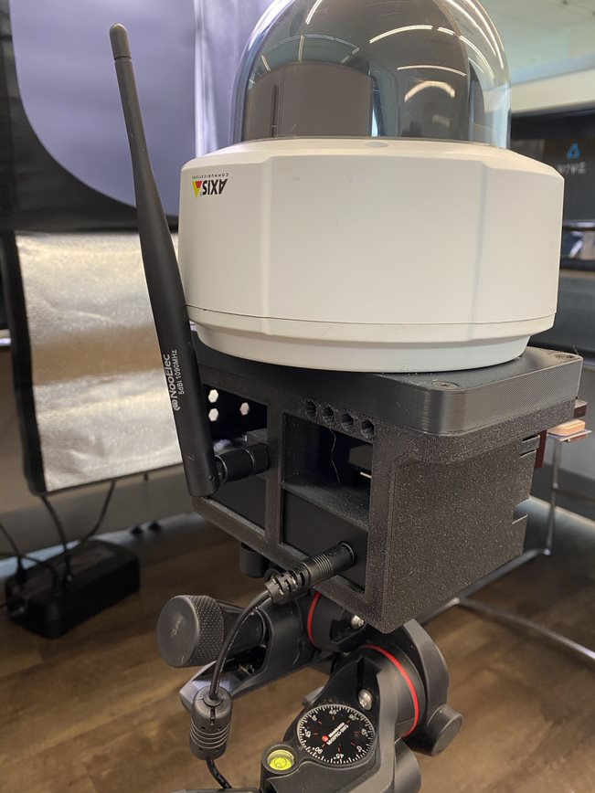
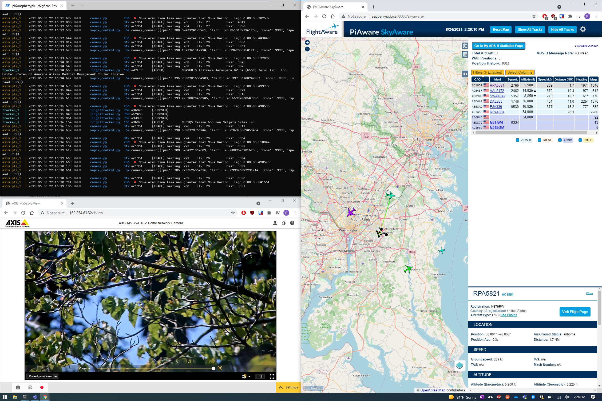

# Hardware Setup/Operation
1. Unpack and connect system components

2. Level tripod and adjustable head using bubble levels

3. Orient camera so it is pointed north

4. Connect the AC adapter to the back of the PoE switch

4. Power on the system (optional use of portable battery station for remote operation)

5. Use the tripod/manfrotto adjustment knobs and the camera web browser video feed to dial-in the aim of the camera

