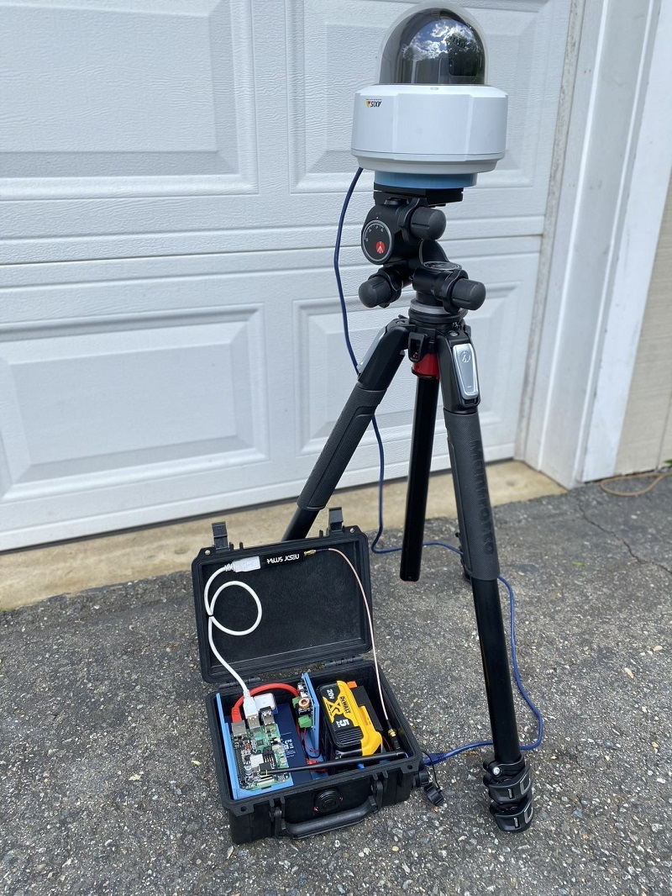
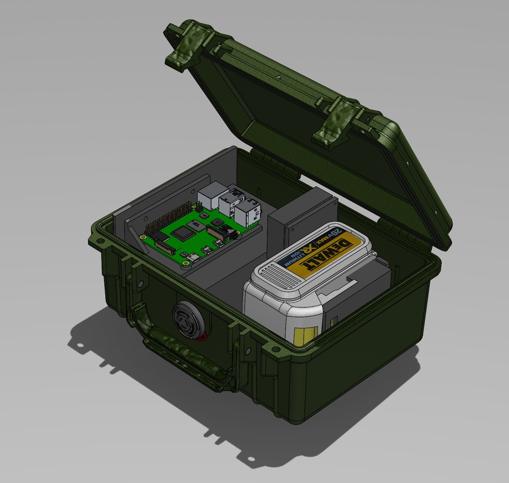
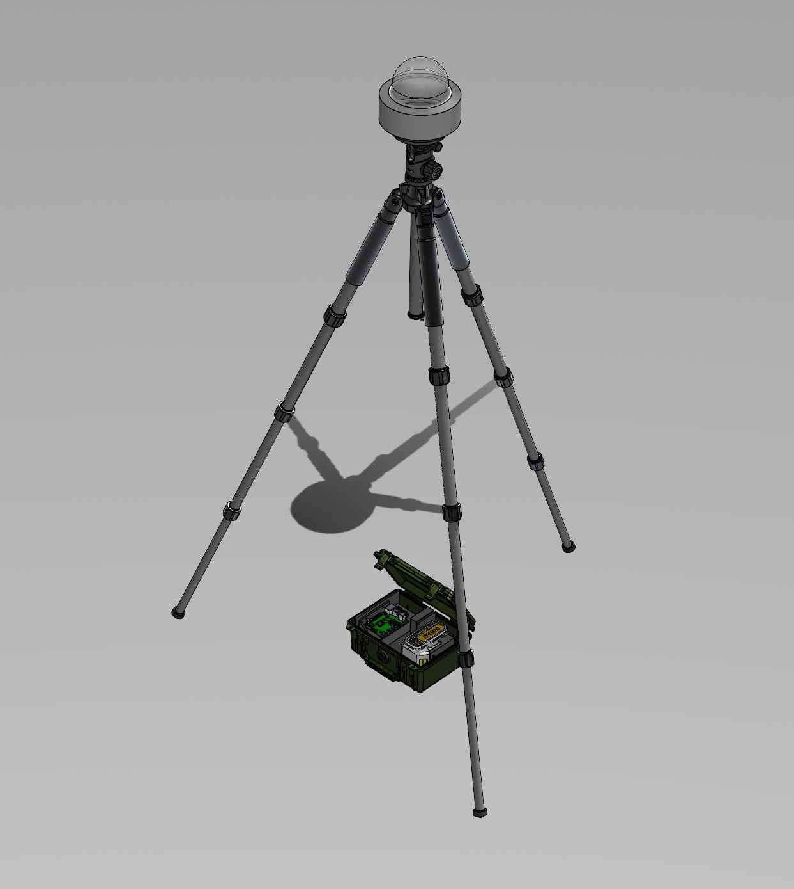

# SkyScan Hardware
## Introduction
This directory contains the information and design files to 3D print and build a SkyScan field kit.

## BOM
| Description                       | Link                                                                                                                                                                                                                                                                                    |
|-----------------------------------|-----------------------------------------------------------------------------------------------------------------------------------------------------------------------------------------------------------------------------------------------------------------------------------------|
| Axis m5525-e PTZ                  | https://www.axis.com/en-us/products/axis-m5525-e                                                                                                                                                                                                                                        |
| Raspberry Pi 4b                   | https://www.amazon.com/CanaKit-Raspberry-4GB-Starter-Kit/dp/B08956GVXN/ref=sr_1_1?crid=1373YVAYTLS10&dchild=1&keywords=pi%2B4%2Bcanakit&m=A30ZYR2W3VAJ0A&qid=1614097442&refinements=p_6%3AA30ZYR2W3VAJ0A&rnid=303116011&s=electronics&sprefix=pi4%2Bcan%2Celectronics%2C146&sr=1-1&th=1 |
| Planet (ISW-504PS) PoE Switch     | https://www.planet.com.tw/storage/products/32358/C-ISW-504PS_s.pdf                                                                                                                                                                                                                      |
| Low Voltage Disconnect            | https://www.amazon.com/Digital-Battery-Low-Voltage-Protection/dp/B07929Y5SZ/ref=pd_sbs_1?pd_rd_w=o0DaA&pf_rd_p=2419a049-62bf-452e-b0d0-ca5b7e35a7b4&pf_rd_r=89MV1M1EDB6CNF0437QS&pd_rd_r=d870a1be-d700-4a98-8823-17ce5111dbc6&pd_rd_wg=JyvsQ&pd_rd_i=B07929Y5SZ&psc=1                   |
| SDR                               | https://www.nooelec.com/store/sdr/nesdr-smart-sdr.html                                                                                                                                                                                                                                  |
| USB GPS                           | https://www.amazon.com/Stratux-GPYes-2-0-u-blox-unit/dp/B0716BK5NT/ref=sr_1_3?dchild=1&keywords=stratux+gps&qid=1612455641&sr=8-3                                                                                                                                                       |
| DeWALT 20V 5Ah Battery            | https://www.amazon.com/DEWALT-DCB205-5-0Ah-Lithium-Battery-Pack/dp/B00KWRM5Z4/ref=sr_1_9?dchild=1&keywords=dewalt+battery&qid=1620007627&sr=8-9                                                                                                                                         |
| Tripod                            |                                                                                                                                                                                                                                                                                         |
| Ethernet cables (various lengths) |                                                                                                                                                                                                                                                                                         |

## 3D Design Files

[STLs](STL)

## Hardware License

This work by <a rel="cc:attributionURL dct:creator" property="cc:attributionName" href="https://www.iqt.org/labs/">IQT Labs LLC</a> is licensed under <a rel="license" href="https://creativecommons.org/licenses/by/4.0">CC BY 4.0</a>
