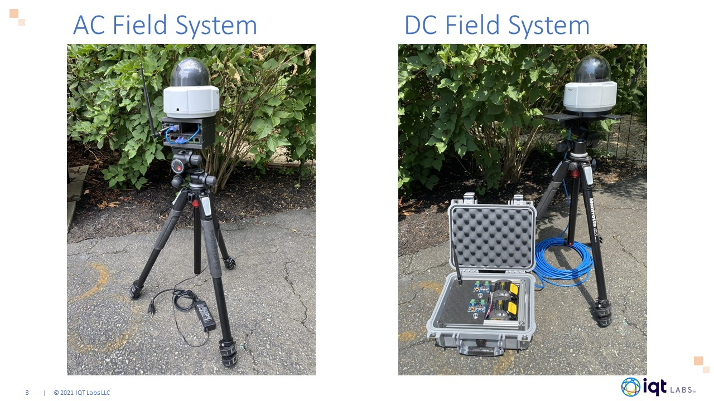
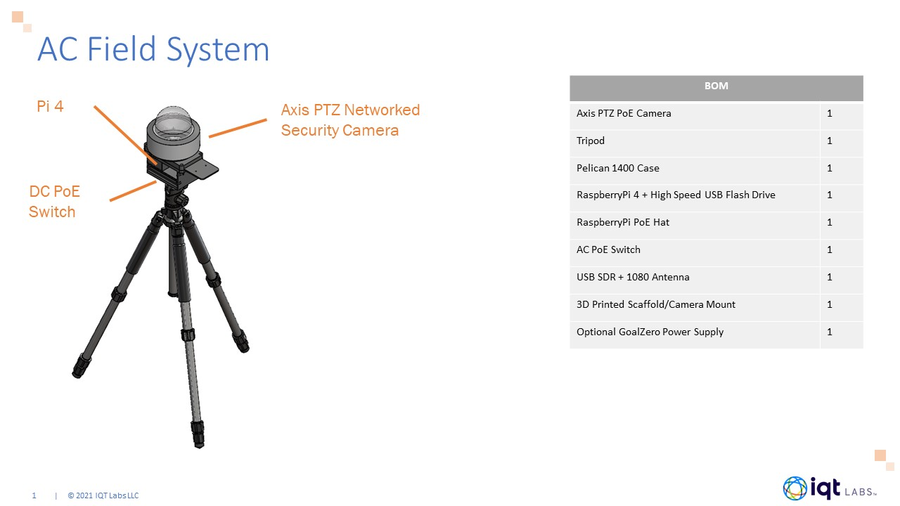
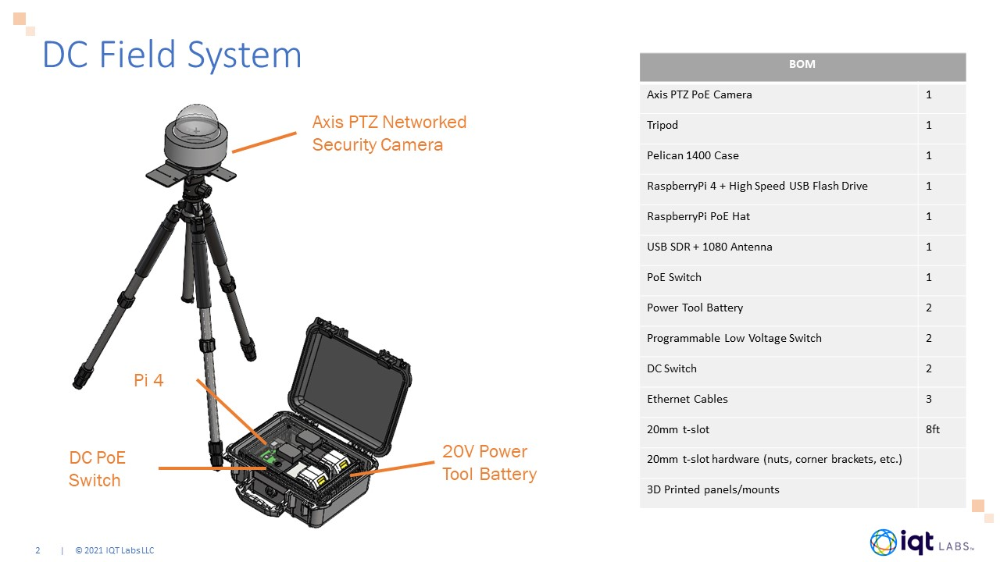

# SkyScan Hardware

## Introduction

This directory contains the information to build the AC and DC powered SkyScan Field Systems

## 3D Design Files

[STLs](STL)
---

## Hardware License

This work by <a rel="cc:attributionURL dct:creator" property="cc:attributionName" href="https://www.iqt.org/labs/">IQT Labs LLC</a> is licensed under <a rel="license" href="https://creativecommons.org/licenses/by/4.0">CC BY 4.0</a>
