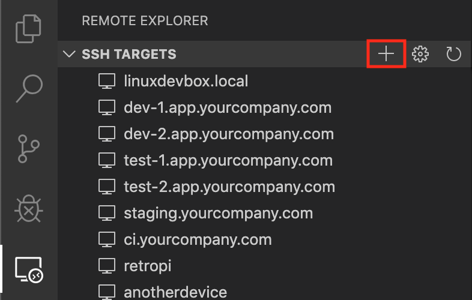
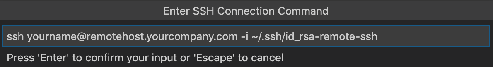

# How to get started using Editing over SSH

This config lets you edit files on an AWS instance using an editor that is running on a local laptop. All of the files remain on the AWS instance and are edited over SSH.

## Requirements

The basic overview on developing over SSH is here: https://code.visualstudio.com/docs/remote/ssh

## Setting things up

1. Figure out the IP Address for the AWS Instance and have .
1. Install the SkyScan repo on the instance. I have been installing it at: `/home/ubuntu/SkyScan-Private`
    1. `cd ~`
    1. `git clone https://github.com/IQTLabs/SkyScan.git`
    1. You can install it to other Directories, but you will need to modify some of the config files so it gets mapping into the containers correctly.
1. On the Dev Laptop:
    1. Open up VSCode
    1. Goto **File** and **Open Workspace** and select the SkyScan Workspace in the repo folder
    1. Goto **View** and **Extensions**
        1. Search for *Remote Development* extension pack and install it

*Now go follow the steps [here](https://code.visualstudio.com/docs/remote/ssh#_remember-hosts-and-advanced-settings)... short summary:*
1. Start by selecting Remote-SSH: Add New SSH Host... from the Command Palette (F1) or clicking on the Add New icon in the SSH Remote Explorer in the Activity Bar.

1. You'll then be asked to enter the SSH connection information. Enter  the full ssh command you would use to connect to the host from the command line:
    
1. Finally, you'll be asked to pick a config file to use. 
1. From this point forward, the host will appear in the list of hosts when you select Remote-SSH: Connect to Host... from the Command Palette (F1) or in the SSH Targets section of the Remote Explorer.

1. The Remote Explorer allows you to both open a new empty window on the remote host or directly open a folder you previously opened. Expand the host and click on the Open Folder icon next to the folder you want to open on the host.

