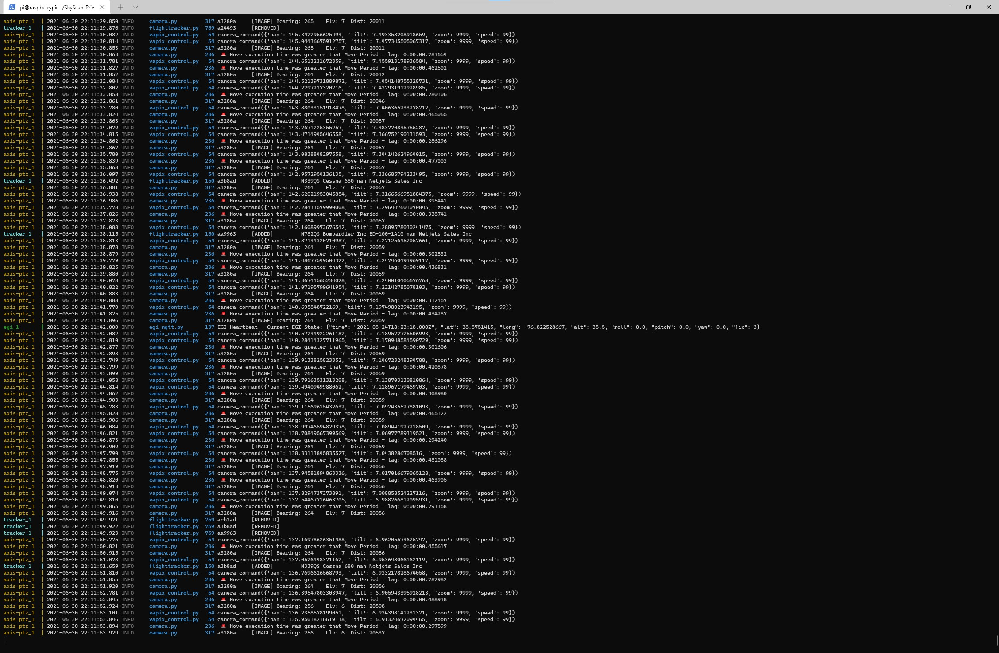

# Software Operation

SSH to the RaspberryPi and launch the application using docker-compose: 
```bash
cd ~/Projects/SkyScan
docker-compose up
```

You should see all of the docker containers start successfully:



A web interface will be available on **port 8080**. As pictures of planes are captured they will be saved in folders in the **./capture** directory.


When operating the system it is helpful to tile all of the windows to monitor the state of the system components:


## Testing with pytest

To run tests with pytest, run:

```bash
pytest
```